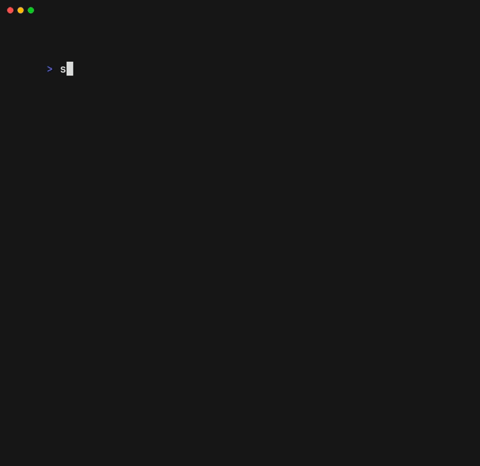

# Sledge 🛷

A small, simple, minimalistic, and fast Redis TUI client written in Go.

<p align="center">
  
</p>

## Usage

- Example below shows how to connect to a local Redis server:

```sh
sledge "redis://localhost:6379"
```
- It is always a good idea to wrap the connection string in quotes to avoid shell expansion.


## Installation

You can install the appropriate binary for your operating system by visiting the [Release page](https://github.com/somnek/sledge/releases/).

**Note**:  
If you're on macOS, you may need to run:

```sh
xattr -c ./Sledge\ v0.1.1\ Darwin\ x86_64.tar.gz
```

to (to avoid "unknown developer" warning)

## Controls

| Key        | Description |
| ---------- | ----------- |
| `j`        | Down        |
| `k`        | Up          |
| `g`        | To Top      |
| `G`        | To Bottom   |
| `Ctrl + C` | Quit        |

## Features

Currently, **Sledge** supports the following types:

- String
- List
- Set
- Hash
